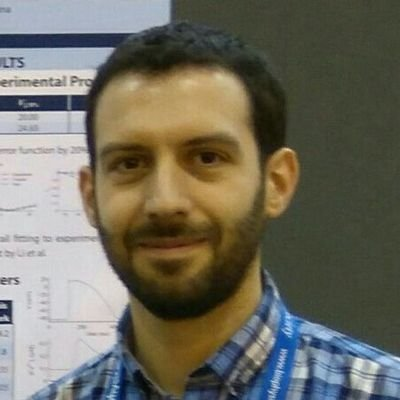

<link rel="stylesheet" href="styles.css" type="text/css">

Jesús Carro was born in Oviedo (Asturias, Spain), in 1985. He received the M.Sc. degree in Telecommunication Engineering in 2009 at the University of Oviedo, and the M.Sc. degree in Biomedical Engineering (2010) and the Ph.D. in Biomedical Engineering (2019) at the University of Zaragoza.

His research interests are focused on the mathematical modeling of the electrical activity of the cardiac cells. In particular, he is working in a new electrophysiological model of the human ventricular cells. He has participated in several national research projects.

Since 2011, he is working at the <a href="https://usj.es">University San Jorge (Zaragoza, Spain)</a>. He is currently an Associate Professor, and the Director of the Degree in Bioinformatics.

In 2018, he was elected as a member of the CellML Editorial Boar for three years (2018-2021).